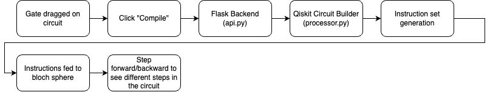

# Programmable Quantum Circuit Visualizer (PQCV)
Programmable Quantum Circuit Visualizer (PQCV) is an open source React application that uses Qiskit via [API]() to simulate quantum circuits generated by the user.

PQCV aims to visualize any circuit the user creates by dragging and dropping gates into the builder window.

# Current State
Currently, PQCV supports the simulation of single-qubit systems. It provides the ability to compile and step through a circuit while viewing the vector that represents the qubits state on the bloch sphere.

## Current supported gates
- H
- S
- X
- Y
- Z

# Goal
Help users visualize and understand quantum circuits by animating multiple-qubit systems.

Most circuit visualizers/simulators provide the output of the circuit as a whole. I think it would help beginners to have the option to go deeper into the circuit step by step to better understand what's actually happening.

# Builder 1

## Workflow from Builder 1

# Setup
## install npm packages
<pre> <code> npm i </code> </pre>

## pip install
<pre> <code> pip install -r requirements.txt </code> </pre>

## start frontend
<pre> <code> npm run dev </code> </pre>

## start backend
<pre> <code> npm start </code> </pre>

## eslint
<pre> <code> npm run lint </code> </pre>

